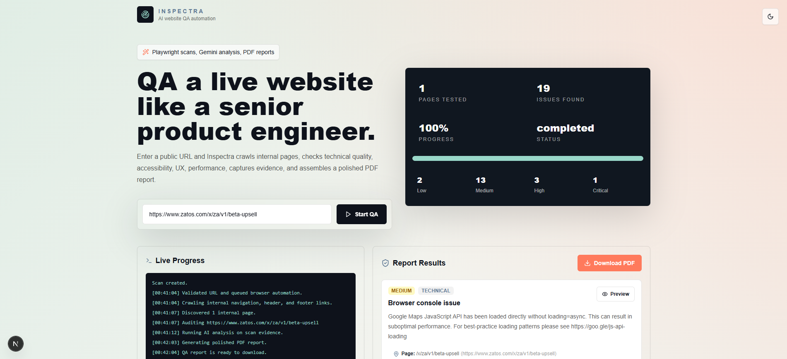

# Inspectra — AI Website QA Automation SaaS



> A modern SaaS-style website auditor that uses Playwright to crawl and test internal pages, Gemini to analyze findings, and PDF generation to deliver professional audit reports.

## 🚀 What this project does

Inspectra automates website QA by:

- crawling same-origin pages from a public URL
- running Playwright-powered browser audits
- capturing screenshots for evidence
- summarizing issues with AI analysis
- exporting a PDF report for review and sharing

## ✨ Core roles and technologies

- `Next.js` — UI, API routes, and app hosting
- `TypeScript` — typed application logic and safer development
- `Tailwind CSS` — responsive SaaS-style interface
- `Playwright` — browser automation, page audits, and screenshot capture
- `Gemini` — AI layer for higher-level analysis and recommendations
- `PDF generation` — report output stored locally under `/reports`
- local `screenshots` + `reports` storage for fast MVP behavior

## 🔧 Features

- Public URL validation and SSRF-safe scanning
- Asynchronous job lifecycle with live polling
- Internal crawl of homepage, navbar, footer, and same-origin links
- Playwright checks for:
  - console and runtime errors
  - failed requests and broken links
  - broken images
  - SEO metadata quality
  - accessibility issues
  - responsiveness and UI behavior
  - page performance signals
- screenshot evidence for audited pages
- AI-generated recommendations and summaries
- downloadable PDF audit report
- clean dashboard with live logs and issue preview cards

## 🧩 Project structure

```text
/app
  ├─ page.tsx                       # Main dashboard page
/components
  ├─ qa-dashboard.tsx               # UI scanning dashboard
  ├─ screenshot-modal.tsx           # Screenshot preview modal
  ├─ theme-toggle.tsx               # Dark / light mode toggle
/lib
  ├─ config.ts                      # Application configuration and env parsing
/services
  ├─ browser-service.ts             # Playwright browser lifecycle
  ├─ crawler-service.ts             # Same-origin page crawler
  ├─ qa-check-service.ts            # QA rule checks and issue detection
  ├─ screenshot-service.ts          # Local screenshot capture and storage
  ├─ report-generation-service.ts   # PDF/report creation
  ├─ ai-analysis-service.ts         # Gemini AI analysis boundary
  ├─ job-store.ts                   # In-memory scan job state
  ├─ telegram-integration.ts        # Future notification hook
/types
  ├─ qa.ts                          # QA job and issue type definitions
/reports                            # Generated audit reports
/screenshots                        # Captured page evidence
/temp                               # Temporary runtime artifacts
```

## ⚙️ Installation

```bash
npm install
npx playwright install chromium
```

## 🌱 Environment configuration

Create a `.env` file with these values:

```env
GEMINI_API_KEY=your_gemini_key
AI_PROVIDER=gemini
QA_MAX_PAGES=8
QA_MAX_DEPTH=2
QA_NAVIGATION_TIMEOUT_MS=20000
QA_JOB_TTL_MINUTES=120
```

### Recommended settings

- `GEMINI_API_KEY` — required for AI-driven summaries
- `AI_PROVIDER` — `gemini` (current supported provider)
- `QA_MAX_PAGES` — max pages to audit per scan
- `QA_MAX_DEPTH` — crawl depth from the start page
- `QA_NAVIGATION_TIMEOUT_MS` — Playwright page navigation timeout
- `QA_JOB_TTL_MINUTES` — how long completed jobs stay in memory

## ▶️ Run locally

```bash
npm run dev
```

Open `http://localhost:3002` and use the dashboard to start a QA scan.

## 🧪 Usage flow

1. Enter a public website URL in the dashboard.
2. Click **Start QA**.
3. The backend enqueues a scan job and returns a `jobId`.
4. The browser service crawls same-origin pages and runs Playwright checks.
5. Screenshots are captured and stored in `/screenshots`.
6. AI analysis generates recommendations and report narrative.
7. A PDF report is produced in `/reports`.
8. Download the report from the UI when the scan completes.

## 📡 API reference

### Start a scan

`POST /api/qa/start`

Request body:

```json
{ "url": "https://example.com" }
```

Response:

```json
{ "jobId": "qa_...", "status": "queued" }
```

### Poll scan status

`GET /api/qa/status?jobId=qa_...`

Returns live job progress, logs, and report metadata.

### Download report

`GET /api/qa/report?jobId=qa_...`

Downloads the generated PDF audit report.

## 🛠️ What each service does

- `browser-service.ts` — launches Chromium and manages browser contexts
- `crawler-service.ts` — discovers same-origin internal pages
- `qa-check-service.ts` — analyzes pages for issues and rules
- `screenshot-service.ts` — captures and stores page screenshots
- `ai-analysis-service.ts` — enriches results with Gemini AI
- `report-generation-service.ts` — builds the final report document
- `job-store.ts` — holds temporary job data for polling

## 📦 Production notes

- Replace the in-memory job store with Redis or a database for scaling
- Use cloud storage for screenshots and report files
- Add authentication and team support
- Run scans in isolated containers for stronger security
- Add CI/scheduled scan automation using the same service boundary

## 💡 Helpful tips

- If scanning fails because browsers are missing, run:
  ```bash
  npx playwright install chromium
  ```
- Keep `QA_MAX_PAGES` and `QA_MAX_DEPTH` low for fast scans
- Use a publicly reachable URL with same-origin pages for best results
